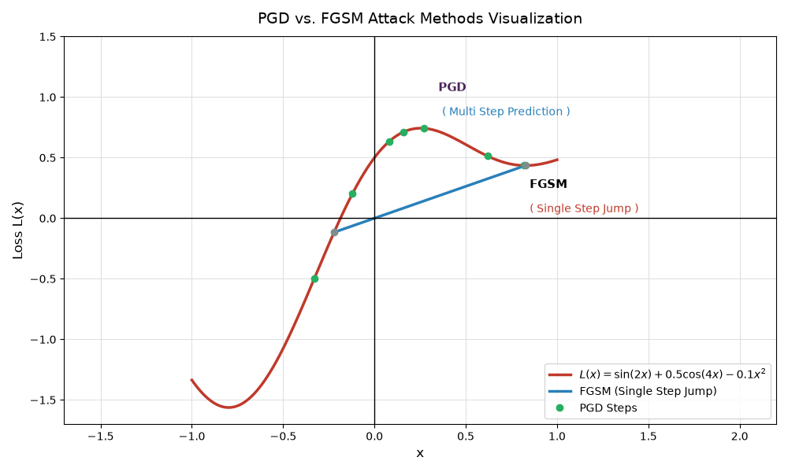

# FGSM / PGD Adversarial Examples on an Image Classifier

## Background: The Vulnerability of Deep Neural Networks

Deep Neural Networks (DNNs) achieve high performance on image classification tasks, but they are surprisingly fragile. By adding imperceptible, carefully crafted perturbations to an input image, an attacker can trick a high-accuracy classifier into outputting an incorrect prediction with high confidence. These modified inputs are called **adversarial examples**.

| | | | | |
|:-:|:-:|:-:|:-:|:-:|
| <figure>  <figcaption></figcaption> $x$ <br> **panda** *(57.7% Confidance)* </figure> | $ + .007× $ | <figure>  <figcaption> $$\text{sign}\left(\nabla_{\mathbf{x}} \mathcal{L}(\boldsymbol{\theta}, \mathbf{x}, y)\right) $$ **nematod** *(8.2% Confidance)*  </figcaption> </figure> | $=$ | <figure>  <figcaption> $$ \mathbf{x} + \epsilon \cdot \text{sign}\left(\nabla_{\mathbf{x}} \mathcal{L}(\boldsymbol{\theta}, \mathbf{x}, y)\right) $$ **gibbon** *(99.3% Confidance)*  </figcaption> </figure> |
<div align="left">
Figure: A demonstration of fast adversarial example generation applied to GoogLeNet 
<a href="https://arxiv.org/html/1412.6572v3#bib.bib18">(Szegedy et al., 2014a) </a>on ImageNet
</div>

---

<br>
Adversarial attacks exploit the local linear behavior of deep neural networks in high-dimensional spaces. Instead of searching randomly, gradient-based attacks utilize the model's loss function gradient to calculate the exact direction of perturbation that maximizes classification error.

---

## Adversarial Attacks: FGSM vs. PGD

Gradient-based attacks primarily operate under an $L_\infty$ distance constraint ($\|\boldsymbol{\delta}\|_\infty \le \epsilon$), ensuring that no single pixel in the original image $\mathbf{x}$ is changed by more than a predefined budget $\epsilon$.

### 1. Fast Gradient Sign Method (FGSM)

FGSM is a single-step, local gradient attack introduced by Goodfellow et al. It moves the original image pixels one step in the direction of the sign of the loss gradient.

| Formula | Symbol Definitions |
| :---: | :--- |
| $$\mathbf{x}_{\text{adv}} = \mathbf{x} + \epsilon \cdot \text{sign}\left(\nabla_{\mathbf{x}} \mathcal{L}(\boldsymbol{\theta}, \mathbf{x}, y)\right)$$ | <ul><li>**$\mathbf{x}$**: Original input image tensor</li><li>**$\mathbf{x}_{\text{adv}}$**: Resulting adversarial image tensor</li><li>**$\epsilon$**: Maximum allowable perturbation size per pixel ($L_\infty$ bound)</li><li>**$\mathcal{L}$**: Model loss function (e.g., Cross-Entropy Loss)</li><li>**$\boldsymbol{\theta}$**: Model parameters (weights and biases)</li><li>**$y$**: True target label of the input image</li><li>**$\nabla_{\mathbf{x}}$**: Gradient operator with respect to input $\mathbf{x}$</li><li>**$\text{sign}(\cdot)$**: Returns $+1$ for positive gradients and $-1$ for negative gradients</li></ul> |

---

### 2. Projected Gradient Descent (PGD)

PGD is an iterative generalization of FGSM proposed by Madry et al. It models adversarial attack generation as a constrained optimization problem. Instead of taking one large step of size $\epsilon$, PGD takes multiple smaller steps of size $\alpha$ and projects the result back onto the valid $\epsilon$-ball after each iteration.

| Formula | Symbol Definitions |
| :---: | :--- |
| **Initialization:**<br>$$\mathbf{x}^{0} = \mathbf{x} + \text{Uniform}(-\epsilon, +\epsilon)$$<br><br>**Iterative Step (for $t = 0, \dots, k-1$):**<br>$$\mathbf{x}^{t+1} = \Pi_{\mathbf{x} + S} \left( \mathbf{x}^t + \alpha \cdot \text{sign}\left(\nabla_{\mathbf{x}^t} \mathcal{L}(\boldsymbol{\theta}, \mathbf{x}^t, y)\right) \right)$$ | <ul><li>**$\mathbf{x}^0$**: Initial image with uniform random noise added</li><li>**$\mathbf{x}^t$**: Adversarial image tensor at iteration $t$</li><li>**$\alpha$**: Step size per iteration (typically $\alpha = \epsilon / k$)</li><li>**$k$**: Total number of attack iterations</li><li>**$\Pi_{\mathbf{x} + S}$**: Projection operator mapping values back inside the $\epsilon$-neighborhood $S = \{\boldsymbol{\delta} \mid \|\boldsymbol{\delta}\|_\infty \le \epsilon\}$ and clipping pixel values to $[0, 1]$</li></ul> |

---

## Comparison Summary: FGSM vs. PGD

| Property | FGSM | PGD |
| :--- | :--- | :--- |
| **Step Type** | Single-step attack | Multi-step iterative attack |
| **Computational Speed** | Fast (1 backward pass) | Slower ($k$ backward passes) |
| **Optimization Goal** | Local linear approximation | Multi-step local search (First-order adversary) |
| **Attack Success Rate** | Moderate | Very High |
| **Primary Paper Reference** | [Goodfellow et al. (Explaining and Harnessing Adversarial Examples)](https://arxiv.org/abs/1412.6572) | [Madry et al. (Towards Deep Learning Models Resistant to Adversarial Attacks)](https://arxiv.org/abs/1706.06083) |

---

## Visualization: FGSM vs. PGD Optimization Trajectory

The schematic below illustrates the key structural difference between FGSM (a single step extending to the boundary of the $\epsilon$-ball) and PGD (an iterative path navigating the loss landscape inside the $\epsilon$-ball):

<figure>

</figure>

## System Architecture & Attack Setup

### Attack Variations by Visibility

* **White-Box Attack Environment:**
  * **Model Architecture:** Lightweight Custom CNN (2 Convolutional layers with ReLU & MaxPool, followed by 2 Fully-Connected layers).
  * **Role:** Serves as the primary target model for computing exact gradients ($\nabla_{\mathbf{x}} \mathcal{L}$) via backpropagation.
  * **Adversarial Training Extension (Paper 2 Min-Max Formulation):** The custom CNN can be trained robustly using the saddle-point optimization formulation proposed by Madry et al.

| Formula | Symbol Definitions |
| :---: | :--- |
| $$\min_{\boldsymbol{\theta}} \rho(\boldsymbol{\theta}), \quad \text{where} \quad \rho(\boldsymbol{\theta}) = \mathbb{E}_{(\mathbf{x}, y) \sim \mathcal{D}} \left[ \max_{\boldsymbol{\delta} \in \mathcal{S}} \mathcal{L}(\boldsymbol{\theta}, \mathbf{x} + \boldsymbol{\delta}, y) \right]$$ | <ul><li>**$\min_{\boldsymbol{\theta}}$**: Outer minimization training the network parameters $\boldsymbol{\theta}$ to reduce overall loss</li><li>**$\rho(\boldsymbol{\theta})$**: Expected risk under worst-case adversarial perturbation</li><li>**$\mathbb{E}_{(\mathbf{x}, y) \sim \mathcal{D}}$**: Expectation over the data distribution $\mathcal{D}$</li><li>**$\max_{\boldsymbol{\delta} \in \mathcal{S}}$**: Inner maximization searching for the worst-case perturbation $\boldsymbol{\delta}$ within valid set $\mathcal{S} = \{\boldsymbol{\delta} \mid \|\boldsymbol{\delta}\|_\infty \le \epsilon\}$</li><li>**$\mathcal{L}(\boldsymbol{\theta}, \mathbf{x} + \boldsymbol{\delta}, y)$**: Model loss on the perturbed input given true label $y$</li></ul> |

* **Black-Box Attack Environment:**
  * **Candidate Models:** Pretrained **ResNet-18**, **MobileNetV3-Small**, and **DenseNet-121**.
  * **Transferability Mechanism:** Gradients cannot be computed directly from black-box targets. Perturbations ($\boldsymbol{\delta}$) generated on the white-box Custom CNN (surrogate model) are directly applied to test black-box models. Transferability relies on shared decision boundaries across different architectures trained on the same data domain.

---

### Attack Variations by Intent: Untargeted vs. Targeted

Attacks are configured based on whether the objective is general misclassification or forcing a specific target label.

| Attack Type | Formulation & Loss Objective | Symbol Definitions |
| :--- | :---: | :--- |
| **Untargeted Attack**<br>*(Maximize loss on true label $y$)* | $$\mathbf{x}_{\text{adv}} = \mathbf{x} + \epsilon \cdot \text{sign}\left(\nabla_{\mathbf{x}} \mathcal{L}(\boldsymbol{\theta}, \mathbf{x}, y)\right)$$ | <ul><li>**$y$**: True ground-truth label</li><li>**$\nabla_{\mathbf{x}} \mathcal{L}$**: Moves image away from correct class boundary</li></ul> |
| **Targeted Attack**<br>*(Minimize loss on target label $y_{\text{target}}$)* | $$\mathbf{x}_{\text{adv}} = \mathbf{x} - \epsilon \cdot \text{sign}\left(\nabla_{\mathbf{x}} \mathcal{L}(\boldsymbol{\theta}, \mathbf{x}, y_{\text{target}})\right)$$ | <ul><li>**$y_{\text{target}}$**: Attacker's desired false label ($y_{\text{target}} \neq y$)</li><li>**$-\epsilon$**: Step direction subtracted to minimize loss toward $y_{\text{target}}$</li></ul> |

---

### Datasets & Pipeline Flexibility

* **Primary Benchmark Datasets:**
  * **MNIST:** Single-channel grayscale ($1 \times 28 \times 28$), 10 classes. Pixel intensity normalized to $[0, 1]$.
  * **CIFAR-10:** Three-channel color ($3 \times 32 \times 32$), 10 classes. Standardized across RGB color channels.
* **Custom Arbitrary Image Pipeline:**
  * Accepts standard user-provided images (PNG/JPEG) of any dimension.
  * Dynamically resizes inputs to the model target shape ($28 \times 28$ or $32 \times 32$), normalizes tensor ranges to $[0, 1]$, computes $\boldsymbol{\delta}_{\text{FGSM}}$ or $\boldsymbol{\delta}_{\text{PGD}}$, and re-scales outputs for live presentation.

  ## Defense Mechanisms

### 1. Model Retraining (Adversarial Training)

* **FGSM Adversarial Training ([Goodfellow et al.](https://arxiv.org/abs/1412.6572)):** Trains the custom CNN on a 50/50 mixture of clean images and single-step FGSM adversarial images to increase boundary robustness.
* **PGD Min-Max Adversarial Training ([Madry et al.](https://arxiv.org/abs/1706.06083)):** Replaces clean training samples with worst-case PGD perturbations generated on-the-fly inside the inner optimization loop of every training batch.

---

### 2. Pre-processing Detection (Feature Squeezing)

Feature squeezing ([Xu et al.](https://arxiv.org/abs/1704.01155)) acts as a non-differentiable pre-processing layer to detect adversarial inputs by comparing model prediction probability vectors before and after input reduction.

#### Squeezing Techniques

* **Bit Depth Reduction:** Quantizes 8-bit color values ($[0, 255]$) down to lower bit depths (e.g., 1-bit binary or 4-bit representation), destroying subtle, low-magnitude perturbations ($L_\infty, L_2$ bounds).
* **Spatial Median Filtering:** Applies a sliding spatial window ($2 \times 2$ or $3 \times 3$) to eliminate high-intensity point noise ($L_0$ attacks).

#### ASCII Simulation: $3 \times 3$ Spatial Median Smoothing ($L_0$ Attack Noise Removal)

An $L_0$ attack alters a single pixel with maximum intensity (e.g., pixel value `255` surrounded by background pixels `10`):

```
Step 1: Local Pixel Grid (3x3 Neighborhood)
+----+----+----+
| 10 | 12 | 11 |
+----+----+----+
| 10 |255*| 13 |  <-- (*) Adversarial Noise Pixel (Value = 255)
+----+----+----+
| 09 | 11 | 12 |
+----+----+----+

Step 2: Flatten & Sort Pixel Array
Unsorted: [10, 12, 11, 10, 255, 13, 09, 11, 12]
Sorted:   [09, 10, 10, 11, [11], 12, 12, 13, 255]
^
Median Value = 11

Step 3: Filtered Output Grid
+----+----+----+
| 10 | 12 | 11 |
+----+----+----+
| 10 | 11 | 13 |  <-- Noise Replaced by Median Value (255 -> 11)
+----+----+----+
| 09 | 11 | 12 |
+----+----+----+

```

### 3. Feature Squeezing $L_1$ Distance Detection Pipeline

The detector evaluates the discrepancy between the model output probability vector $g(\mathbf{x})$ on the raw input and $g(\mathbf{x}_{\text{squeezed}})$ on the squeezed input using the $L_1$ distance norm:

| Formula | Symbol Definitions |
| :---: | :--- |
| $$\text{score}^{(\mathbf{x}, \mathbf{x}_{\text{squeezed}})} = \| g(\mathbf{x}) - g(\mathbf{x}_{\text{squeezed}}) \|_1$$ | <ul><li>**$g(\mathbf{x})$**: Output probability vector for the raw input tensor $\mathbf{x}$</li><li>**$g(\mathbf{x}_{\text{squeezed}})$**: Output probability vector for the squeezed input tensor $\mathbf{x}_{\text{squeezed}}$</li><li>**$\|\cdot\|_1$**: $L_1$ norm distance sum, bounded strictly in range $[0.0, 2.0]$</li></ul> |

```
DETECTION DECISION TREE
                          
                 [ Input Image Tensor: x ]
                            |
           +----------------+----------------+
           |                                 |
   (Original Model)                  (Feature Squeezer)
   Output: g(x)                      Input: x_squeezed
           |                                 |
           |                         (Original Model)
           |                         Output: g(x_squeezed)
           |                                 |
           +----------------+----------------+
                            |
               [ L1 Distance Metric Calculation ]
                Score = || g(x) - g(x_sq) ||_1
                            |
          +-----------------+-----------------+
          |                                   |
Score <= Threshold                   Score > Threshold
          |                                   |
  [ CLEAN / LEGITIMATE ]              [ ADVERSARIAL DETECTED ]

```

* **Joint Detector Decision Rule:**
  $$\text{score}^{\text{joint}} = \max\left(\text{score}^{(\mathbf{x}, \mathbf{x}_{\text{bit}})}, \text{score}^{(\mathbf{x}, \mathbf{x}_{\text{median}})}\right)$$
  If $\text{score}^{\text{joint}} > T$ (where threshold $T$ is tuned on clean validation data to maintain FPR $< 5\%$), the input is flagged as adversarial.

## Metrics, Visualizations & Validation Strategy

### Trade-off & Performance Analysis

* **Clean vs. Robust Accuracy:** Evaluate the fundamental trade-off introduced by adversarial training—measuring the baseline test accuracy degradation on clean images versus accuracy retention under active FGSM and PGD attacks.
* **Model Capacity vs. Robustness:** Investigate network parameter limits; smaller custom CNNs tend to overfit to specific perturbations, whereas higher model capacity (e.g., deeper channels/layers) is necessary for stable PGD adversarial training.
* **Attack Parameters & Hyperparameter Exploration:**
  * **Perturbation Budget Scope:** Varying maximum noise bound $\epsilon \in [0.01, 0.3]$.
  * **Iterative Trajectory Control:** Varying PGD iteration steps $k \in \{5, 7, 10, 20\}$ alongside proportional step sizes ($\alpha = \epsilon / k$).
  * **Objective Alignment:** Comparing targeted vs. untargeted loss formulations across standard and robustly trained checkpoints.

---

### Visualization Requirements

* **Image Transformation Matrix:** Generate side-by-side comparative matrices displaying:

```
[ Original Image ] ----> [ Perturbation Noise (Scaled x10) ] ----> [ Adversarial Image ]
```

* **Accuracy vs. $\epsilon$ Decay Curves:** Plot model accuracy degradation as a function of perturbation budget $\epsilon$, contrasting standard models against FGSM-trained and PGD-trained counterparts.
* **Feature Squeezing $L_1$ Discrepancy Histograms:** Plot distribution curves of prediction probability shifts ($L_1$ distances) between clean and adversarial samples to empirically define and validate detection thresholds $T$.

---

### Quantitative Evaluation Matrix Template

| Model Variant | Clean Acc (%) | FGSM Acc ($\epsilon=0.15$) | PGD Acc ($\epsilon=0.15, k=10$) | Black-Box Transfer Acc | Squeezer Detection Rate |
| :--- | :---: | :---: | :---: | :---: | :---: |
| **Standard Custom CNN** | *Baseline* | *Degraded* | *Near 0%* | N/A (Source) | *High* |
| **FGSM-Trained CNN** | *Slight Drop* | *Resilient* | *Moderate* | *Moderate* | *Evaluated* |
| **PGD Min-Max CNN** | *Trade-off Drop*| *Highly Robust*| *High Robustness* | *High Defense* | *Evaluated* |
| **Black-Box Target (ResNet-18)**| *Baseline* | *Transferred Loss* | *Transferred Loss* | *Target Model* | *N/A* |
